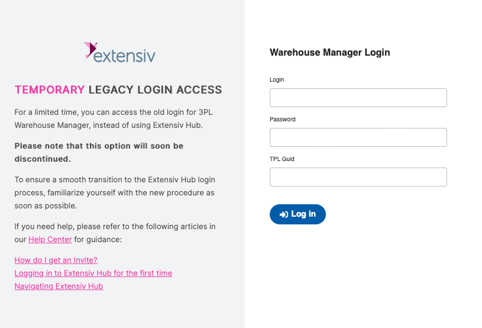
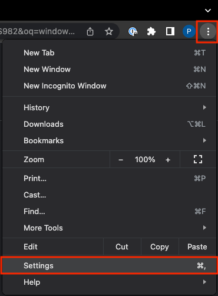
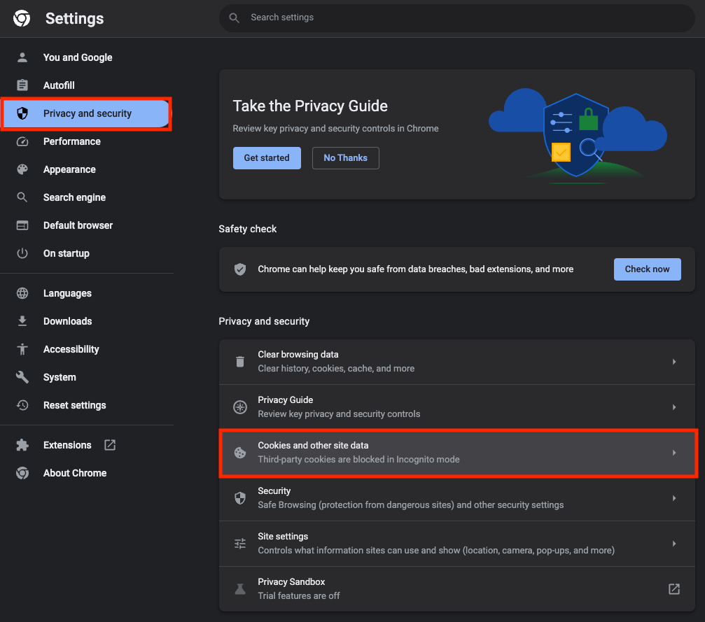
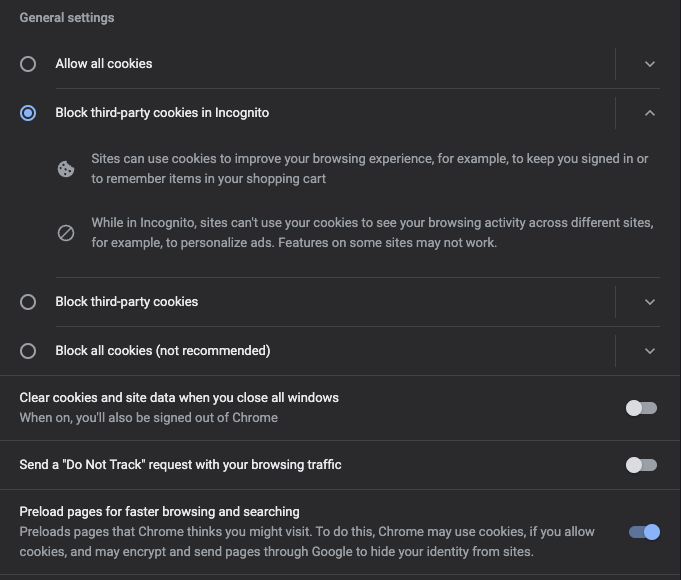
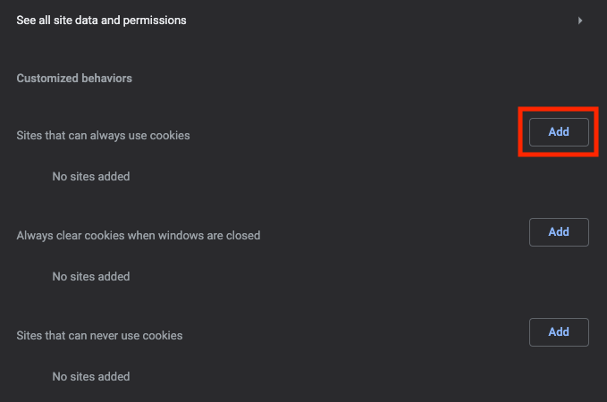
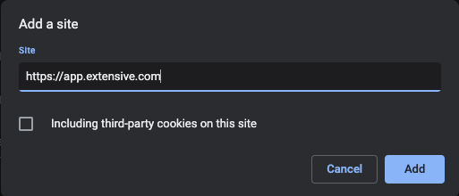

# Extensiv sign-in migration

- [I need new Extensiv credentials](#i-need-new-extensiv-credentials)
- [I have Extensiv credentials, but I forget my old 3PL Central credentials](#i-have-extensiv-credentials-but-i-forget-my-old-3pl-central-credentials)
- [I signed in, but still can't access the Extensiv Hub WMS](#i-signed-in-but-still-cant-access-the-extensiv-hub-wms)
- [Allow Extensiv cookies with Google Chrome](#allow-extensiv-cookies-with-google-chrome)

## I need new Extensiv credentials

All users should have received a welcome email from Extensiv that includes a temporary password and link to sign into the new Extensiv Hub. The message may have been flagged as spam/junk and removed from your inbox. If you can not find the original email address, GWSI can request a new message on your behalf.

[Contact GWSI support](mailto:support@mgearceinc.com?subject=Extensiv%20invitation%20request) to request a new invitation message with a temporary password. In your email message, please be sure to provide the following information we need to verify your account:

- Full name
- Email address
- Company name

## I have Extensiv credentials, but I forget my old 3PL Central credentials

After signing in with your new Extensiv credentials, you may be prompted to sign in again using your old 3PL Central login information. If you don't have your 3PL Central username and/or password, GWSI can request an account update on your behalf. The process will be the same as if your are requesting new Extensiv credentials.

[Contact GWSI support](mailto:support@mgearceinc.com?subject=Extensiv%20invitation%20request) to request a new invitation message with a temporary password. In your email message, please be sure to provide the following information we need to verify your account:

- Full name
- Email address
- Company name

## I signed in, but still can't access the Extensiv Hub WMS

Some users are experiencing issues accessing the Warehouse Manager after signing in with their new Extensiv Hub credentials. The most common issue is another sign in form requesting a _TPL Guid_.

If you encounter this form after signing in with your Extensiv Hub credentials, you need to give your browser permission to use cookies on the Extensiv website.

### Allow Extensiv cookies with Google Chrome

1. Close all tabs/windows associated with Extensiv
2. Select the three vertical dots in the top right corner of the browser, and then select _Settings_.

    

3. Select _Privacy and security_ from the sidebar, and then select _Cookies and other site data_.

    

4. Select _Privacy and security_ from the sidebar, and then select _Cookies and other site data_.

    

5. Your security settings must allow third-party cookies. Depending on your IT setup, you can either choose the option labeled _Block third-party cookies in Incognito_ to allow all third-party cookies (option shown in the above image), or you can specifically allow cookies from Extensiv. To allow cookies from Extensiv, select the _Add_ button next to the setting labeled _Sites that can always use cookies_.

    

6. Enter _<https://app.extensive.com>_ in the input and then select the _Add_ button.

    

After completing these steps, close the browser settings, and then try signing into the Extensiv Hub again.
